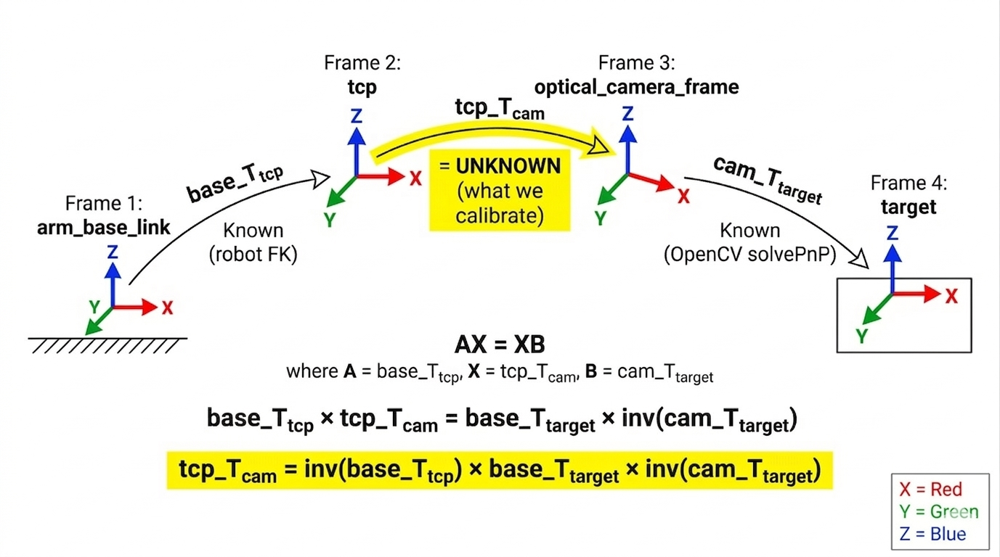
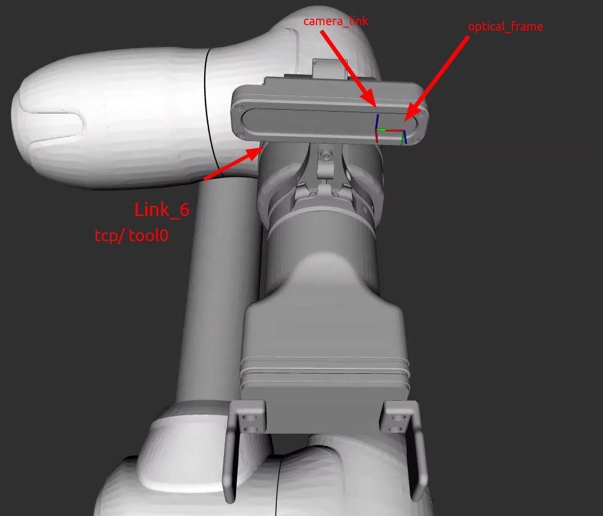
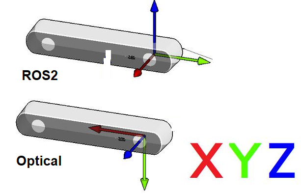
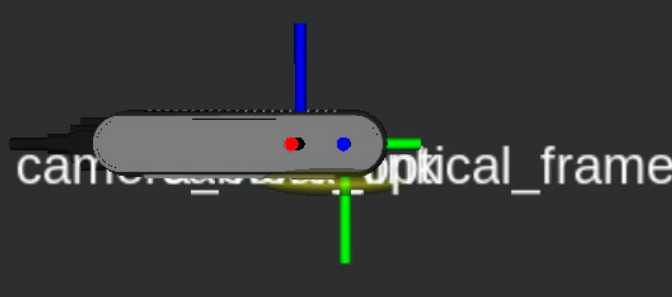
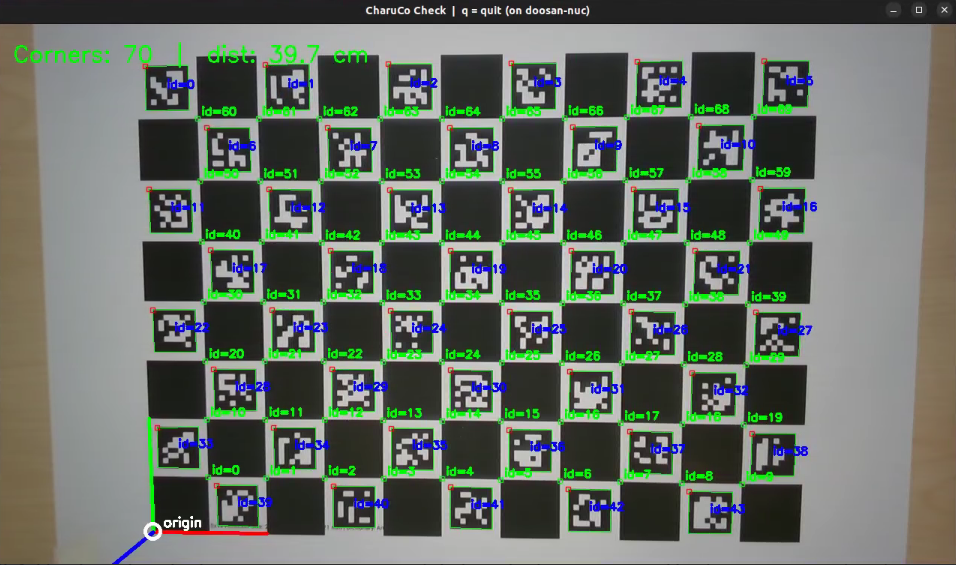
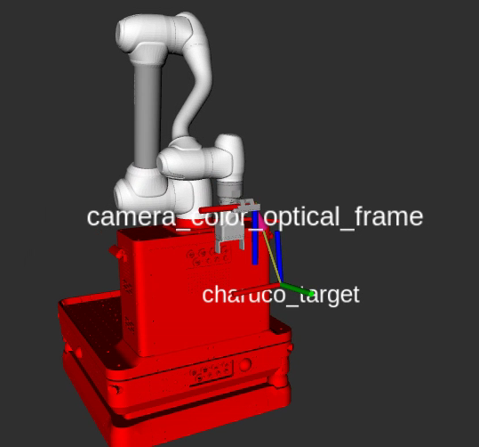

# Hand-Eye Camera Calibration (ROS 2)

This is the ROS 2 version of the ARIC Camera Calibration package. It does hand-eye calibration for eye-on-hand setups using the AX = XB formulation and finds `tcp_T_cam`, the 4x4 rigid transform from the robot's TCP to the camera optical frame.

<p align="center"></p>


## Installation

You will also need a printed ChArUco board. I generated mine from [calib.io](https://calib.io/pages/camera-calibration-pattern-generator).

```bash
cd ~/ros2_ws/src
git clone https://github.com/3bdul1ah/ros2_handeye_camera-calibration.git
pip3 install -r ros2_handeye_camera-calibration/requirements.txt
cd ~/ros2_ws
colcon build --packages-select aric_camera_calibration --symlink-install
source install/setup.bash
```

## Prerequisites

Start your robot and camera drivers before running anything. The calibration only needs the **color** stream. In my case I used a Doosan M1013 with a RealSense D415:

```bash
ros2 launch dsr_bringup2 dsr_bringup2_moveit.launch.py \
  gripper:=2fg14 onrobot_ip:=192.168.1.1 host:=192.168.50.100 mode:=real

ros2 launch realsense2_camera rs_launch.py \
  serial_no:="'210622066079'" \
  enable_color:=true enable_depth:=true \
  rgb_camera.color_profile:=1280,720,15 \
  depth_module.depth_profile:=424,240,15 \
  align_depth.enable:=true \
  enable_sync:=true \
  spatial_filter.enable:=true \
  temporal_filter.enable:=true \
  publish_tf:=true
```

> **Note:** Depth, aligned depth, and the depth-related launch parameters (`depth_module`, `align_depth`, filters) are **not required for calibration**. The calibration uses only the color image and CharuCo board geometry. The depth streams are used by `pixel_picker` for optional depth-based 3D measurements and personal testing.

Verify the color stream after launching:

```bash
ros2 topic echo /camera/camera/color/image_raw --once --no-arr | grep -E "width|height|encoding"
# height: 720, width: 1280, encoding: rgb8
```

If you also want to use `pixel_picker` with depth, verify aligned depth is available:

```bash
ros2 topic echo /camera/camera/aligned_depth_to_color/image_raw --once --no-arr | grep -E "width|height|encoding"
# height: 720, width: 1280, encoding: 16UC1
```

### Using a different robot

Only [`doosan_ros2.py`](aric_camera_calibration/doosan_ros2.py) is specific to my robot. If you want to use this with a different robot, create a new file with a class that has these four methods:

```python
class YourRobot:
    def __init__(self):                    # connect and initialise
    def move_to_calib_start(self) -> bool: # move to the starting joint pose
    def get_current_posx(self) -> list:    # return [x, y, z, rx, ry, rz] in mm/deg
    def move_posx(self, pose) -> bool:     # move to [x, y, z, rx, ry, rz]
    def get_ee_matrix(self) -> np.ndarray: # return 4x4 base_T_tcp in metres
```

Have a look at [`doosan_ros2.py`](aric_camera_calibration/doosan_ros2.py) to see how I did it. Then register your class in [`data_collection_routine.py`](aric_camera_calibration/data_collection_routine.py) (there are commented out examples for UR and ABB) and set `"name"` in the config to match.

### URDF setup

Make sure `camera_link` is defined in your URDF, placed approximately at the camera's mounting point relative to `tool0` (your robot's TCP frame). Follow the [ROS coordinate conventions](https://www.ros.org/reps/rep-0103.html). The RealSense driver will then publish `camera_color_optical_frame` from `camera_link` automatically.

<p align="center"></p>

For the RealSense, `camera_link` goes at the left infrared sensor as described in the [realsense-ros](https://github.com/IntelRealSense/realsense-ros) package:

<p align="center"></p>

You can check the camera_link for your specific RealSense model by referring to [this pull request](https://github.com/IntelRealSense/realsense-ros/pull/1124). In my case:

```bash
ros2 launch realsense2_description view_model.launch.py model:=test_d415_camera.urdf.xacro
```

<p align="center"></p>

### Finding the calibration start pose

The data collection routine needs a starting joint configuration where the ChArUco board is centred in the camera's field of view.

1. Jog the robot manually until the board is visible and well centred.
2. Make sure you edit [`calibration_config.json`](config/calibration_config.json) to match your ChArUco board, then run `charuco_check` to confirm the board is fully detected:

```bash
ros2 run aric_camera_calibration charuco_check
```

<p align="center"></p>

3. Record the joint angles from your robot's API.
4. Add them as `CALIB_START_JOINTS` in [`doosan_ros2.py`](aric_camera_calibration/doosan_ros2.py).

The calibration node generates poses around this starting point using [`build_calib_poses`](aric_camera_calibration/doosan_ros2.py), which moves the camera through a cone of viewpoints with varying position and tilt so the solver gets enough geometric diversity.

## Running the Calibration

Now everything is ready. Make sure [`calibration_config.json`](config/calibration_config.json) matches your setup:

```json
{
  "robot": { "name": "Doosan", "ip": "" },
  "camera": {
    "image_topic": "/camera/camera/color/image_raw/compressed",
    "camera_info_topic": "/camera/camera/color/camera_info"
  },
  "calibration_target": {
    "type": "charuco",
    "size": [11, 8],
    "checker_length": 0.029,
    "marker_length": 0.021,
    "aruco_dict": "DICT_6X6_250",
    "legacy_pattern": true,
    "blur": [7, 1]
  },
  "calibration_data": {
    "project_name": "m1013_calibration",
    "rotate_image_180": false,
    "data_collection_setup": [0.4, 25, 20, 0.15, 0.20],
    "output_file_name": "ee_pose",
    "use_existing_data": false
  }
}
```

- `size` is the number of squares `[columns, rows]`, not inner corners. Measure your printed board and set `checker_length` and `marker_length` in metres.
- `data_collection_setup` is `[max_angle_rad, n_cycles, n_per_cycle, radius_min_m, radius_max_m]`. The node also offers preset options at runtime.
- During calibration you will be asked whether to compute intrinsics from the collected images or load them from the camera's `/camera_info` topic.

Then run:

```bash
ros2 run aric_camera_calibration collect_and_calibrate
```

During calibration the robot will move through the generated poses while the camera captures images. You should see something like this:

<p align="center"></p>

If you want to re-run the calibration on previously collected data, set `"use_existing_data": true` in the config and run the same command again.

### Example output

This is what I got with 101 poses on my Doosan M1013 (run 18):

```
Intrinsic calibration source:
  [0]  Load from RealSense /camera_info topic (default)
  [1]  Compute from collected images (CharuCo calibration)
Choice [0/1]: 1

READING CHARUCO BOARD:
  101/101 images usable.
+------------------------------+
| INTRINSIC CAMERA CALIBRATION |
+------------------------------+
* Reprojection Error: 0.2226
* Camera Matrix
  [909.72   0.    631.43]
  [  0.   912.34  358.80]
  [  0.     0.      1.  ]
* Distortion Coefficients
  [0.1369, -0.4177, -0.0004, -0.0006, 0.3411]

  EE poses matched: 101
+------------------------------+
| EXTRINSIC CAMERA CALIBRATION |
+------------------------------+
Calibration converged!
* tcp_T_cam
  [ 0.99994 -0.01066 -0.00363 -0.03624]
  [ 0.01091  0.99692  0.07769 -0.10530]
  [ 0.00280 -0.07772  0.99697  0.04125]
  [ 0.       0.       0.       1.     ]
* Translation  [-0.036 -0.105  0.041]
* Euler (xyz)  deg X:-4.46  Y:-0.16  Z:0.62

* base_T_target (board origin)
  Translation  [-0.432 -0.118 -0.167]
  Euler (xyz)  deg X:0.65  Y:-0.19  Z:90.96

* Target position std: [0.087, 0.074, 0.183] mm
* Target rotation std: 0.035 deg

Results:
  calibration_data/18/calibration_results.txt
  calibration_data/18/calibration_results.json
```

### Publishing the result

Once you have `tcp_T_cam`, publish it as a static TF. Plug in the translation and Euler angles from the calibration output:

```bash
ros2 run aric_camera_calibration publish_tcp_T_cam_tf -- \
  --x -0.036240 --y -0.105303 --z 0.041253 \
  --roll -4.4578 --pitch -0.1602 --yaw 0.6250
```

This publishes `link_6 -> camera_color_optical_frame_calibrated` by default. You can change frames with `--parent-frame` and `--child-frame`.

### Verifying the calibration

Use `pixel_picker` to verify the calibration result in real time by clicking anywhere on the image logs the 3D coordinates (camera and base frame) via ROS info.

```bash
ros2 run aric_camera_calibration pixel_picker
```

The calibration itself uses only the color stream and CharuCo board geometry to compute both intrinsics and extrinsics. The `pixel_picker` uses calibrated intrinsics (K, D) hardcoded from run 18 and reads the CharuCo board config from the constants at the top of the file (must match `calibration_config.json`).

## Nodes

| Node | Description |
|------|-------------|
| `charuco_check` | Opens a live camera window showing detected markers and the board origin axes. Good for checking your setup before collecting data. No robot needed. |
| `collect_and_calibrate` | Moves the robot through calibration poses, captures images, records TCP poses, then runs intrinsic and extrinsic calibration. Also publishes the detected board as a TF so you can see it in RViz. |
| `publish_tcp_T_cam_tf` | Takes translation (metres) and rotation (degrees, Euler XYZ) and publishes a static TF from `link_6` to `camera_color_optical_frame_calibrated`. Override frames with `--parent-frame` and `--child-frame`. |
| `pixel_picker` | Click on the live image to get 3D coordinates (logged via ROS info). Continuously detects the CharuCo board origin and shows two estimates on-screen: **pose** (CharuCo geometry, no depth) and **depth** (CharuCo X/Y + depth sensor Z). Uses synced aligned depth + color, calibrated intrinsics, and the TF chain. |

## References

The extrinsic solver options and their theory are documented in the [OpenCV calib3d reference](https://docs.opencv.org/4.5.4/d9/d0c/group__calib3d.html).
